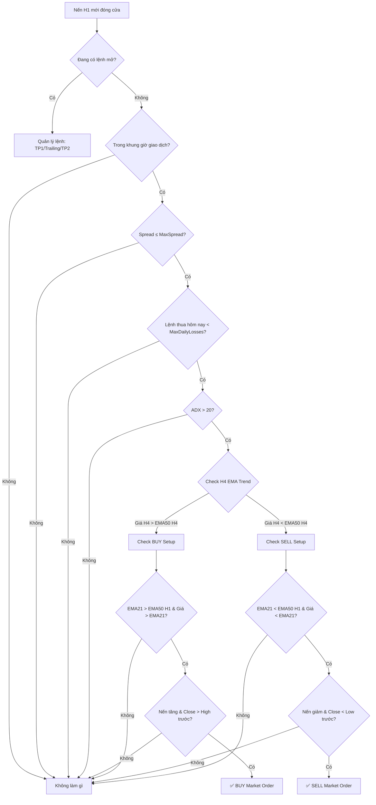

# Chiến Lược: Trend Momentum Rider (H1)
**Cặp tiền:** XAUUSD, USDJPY, US500  
**Khung thời gian:** H1 (Entry) + H4 (Trend Filter)  
**Loại:** Trend Following + Momentum Confirmation

---

## Phần 1: Phân Tích Chiến Lược

### 1. Logic Cốt Lõi — Tại Sao Nó Hoạt Động?

Chiến lược khai thác **hiệu ứng Momentum** — một trong những anomaly được nghiên cứu nhiều nhất trong tài chính:

- **Tâm lý bầy đàn (Herding):** Khi giá bắt đầu trending, các trader retail và institutional đều FOMO vào cùng hướng. Điều này tự tạo ra "lực đẩy" kéo dài xu hướng.
- **Anchoring Bias:** Trader thường neo vào mức giá cũ, chậm phản ứng với thông tin mới. Khi giá vượt khỏi vùng quen thuộc (EMA), momentum tích lũy trước khi thị trường "bắt kịp" giá trị thực.
- **Institutional Flow:** Trên H1, các quỹ lớn thường phân bổ vốn theo trend H4/Daily. Khi H1 align với H4, ta đang đi cùng "dòng tiền lớn".

> **Core Edge:** Mua khi giá đang mạnh + xu hướng lớn ủng hộ = xác suất continuation cao hơn reversal.

### 2. Bộ Lọc Nhiễu (Filters) Lý Tưởng

| Filter | Mục đích | Chi tiết |
|--------|----------|----------|
| **H4 EMA 50** | Xác định trend lớn | Chỉ BUY khi giá H4 > EMA50(H4), chỉ SELL khi giá H4 < EMA50(H4) |
| **ADX(14) > 20 trên H1** | Lọc thị trường sideway | ADX < 20 = thị trường không có trend → không vào lệnh |
| **Spread Filter** | Tránh vào lệnh khi spread cao | XAUUSD ≤ 30 points, USDJPY ≤ 15 points, US500 ≤ 50 points |
| **Khung giờ giao dịch** | Tránh giờ thanh khoản thấp | Chỉ giao dịch trong phiên London + New York |

### 3. Rủi Ro Lớn Nhất

> [!CAUTION]
> **Whipsaw trong chuyển đổi trend:** Rủi ro lớn nhất xảy ra khi thị trường đang chuyển từ trending sang ranging (hoặc ngược lại). Tại các điểm chuyển đổi này:
> - EMA cho tín hiệu trễ → vào lệnh cuối trend → bị stoploss liên tục.
> - ADX lag ~3-5 nến → có thể vẫn > 20 khi trend đã chết.
> - **Mitigation:** Giới hạn tối đa 2 lệnh thua liên tiếp trong ngày. Sau 2 lệnh thua, dừng giao dịch trong ngày đó.

> [!WARNING]
> **Rủi ro sự kiện (Event Risk):** Tin tức lớn (NFP, FOMC, CPI) có thể gây gap hoặc spike vượt stoploss. → Khuyến nghị: Không mở lệnh mới trong 30 phút trước/sau tin tức quan trọng (phải lập trình riêng hoặc tắt EA thủ công).

---

## Phần 2: Quy Luật Cơ Học (Mechanical Rules) cho MT5

### 1. SETUP — Điều Kiện Môi Trường

```
ĐIỀU KIỆN BUY:
├── [S1] Giá đóng cửa H4 hiện tại > EMA(50, H4)
├── [S2] EMA(21, H1) > EMA(50, H1)              // Trend H1 đồng thuận
├── [S3] ADX(14, H1) > 20                        // Thị trường có trend
└── [S4] Giá hiện tại > EMA(21, H1)              // Giá nằm trên EMA nhanh

ĐIỀU KIỆN SELL:
├── [S1] Giá đóng cửa H4 hiện tại < EMA(50, H4)
├── [S2] EMA(21, H1) < EMA(50, H1)
├── [S3] ADX(14, H1) > 20
└── [S4] Giá hiện tại < EMA(21, H1)
```

> **Tất cả 4 điều kiện S1–S4 phải đồng thời TRUE.**

### 2. TRIGGER — Kích Hoạt Lệnh

```
BUY TRIGGER:
└── Nến H1 vừa đóng cửa có:
    ├── Close > Open                              // Nến tăng
    └── Close > High của nến H1 trước đó          // Breakout đỉnh gần nhất
    
SELL TRIGGER:
└── Nến H1 vừa đóng cửa có:
    ├── Close < Open                              // Nến giảm
    └── Close < Low của nến H1 trước đó           // Breakout đáy gần nhất
```

> **Vào lệnh tại giá mở cửa của nến H1 tiếp theo (Market Order).**

### 3. STOPLOSS — Ban Đầu

```
Phương pháp: ATR-based

BUY SL = Entry Price - (ATR(14, H1) × 1.5)
SELL SL = Entry Price + (ATR(14, H1) × 1.5)
```

| Tham số | Giá trị mặc định | Ghi chú |
|---------|-------------------|---------|
| ATR Period | 14 | Tính trên H1 |
| ATR Multiplier cho SL | 1.5 | Input có thể điều chỉnh |
| SL tối thiểu | 100 points (XAUUSD), 150 points (USDJPY), 50 points (US500) | Tránh SL quá gần |

### 4. TAKE PROFIT & TRAILING STOP

```
TAKE PROFIT:
├── TP1 = Entry ± (ATR(14) × 2.0)     // Chốt 50% volume
└── TP2 = Entry ± (ATR(14) × 3.5)     // Chốt 50% còn lại

TRAILING STOP (áp dụng sau khi TP1 đạt):
├── Phương pháp: Chandelier Exit
├── Trailing Distance = ATR(14) × 2.0
├── Trailing Step = ATR(14) × 0.5     // Chỉ dịch SL khi giá đi thêm 0.5×ATR
└── Hướng: Chỉ dịch SL theo hướng có lợi (không bao giờ mở rộng SL)
```

**Luồng quản lý lệnh:**
```
1. Vào lệnh → SL = 1.5×ATR
2. Giá đạt TP1 (2.0×ATR) → Đóng 50% volume + Dời SL về Entry (Breakeven)
3. 50% còn lại → Trailing Stop (Chandelier) cho đến khi:
   - Bị trailing stop out, HOẶC
   - Đạt TP2 (3.5×ATR), HOẶC
   - Hết giờ giao dịch (xem mục 5)
```

### 5. CÀI ĐẶT BỔ SUNG

```
KHUNG GIỜ GIAO DỊCH (Server Time, điều chỉnh theo broker):
├── Phiên London:  08:00 – 12:00 (UTC+0)
├── Phiên NY:      13:00 – 17:00 (UTC+0)
└── Ngoài giờ:     KHÔNG mở lệnh mới (lệnh đang mở vẫn được quản lý)

SPREAD TỐI ĐA (points):
├── XAUUSD:  30
├── USDJPY:  15
└── US500:   50

QUẢN LÝ RỦI RO:
├── Risk per trade:      1-2% balance (input)
├── Max lệnh mở:        1 lệnh/symbol tại 1 thời điểm
├── Max lệnh thua/ngày:  2 (sau đó dừng EA đến ngày mới)
├── Magic Number:        Duy nhất cho mỗi instance
└── Slippage tối đa:    5 points

RESET HÀNG NGÀY:
└── 00:00 Server Time → Reset bộ đếm lệnh thua
```

---

## Phần 3: Tổng Hợp Input Parameters cho MT5

| Input | Type | Default | Mô tả |
|-------|------|---------|-------|
| `MagicNumber` | int | 20260404 | Magic Number |
| `RiskPercent` | double | 1.0 | % balance mỗi lệnh |
| `EMA_Fast_Period` | int | 21 | EMA nhanh trên H1 |
| `EMA_Slow_Period` | int | 50 | EMA chậm trên H1 |
| `H4_EMA_Period` | int | 50 | EMA trên H4 (trend filter) |
| `ADX_Period` | int | 14 | Chu kỳ ADX |
| `ADX_Threshold` | double | 20.0 | Ngưỡng ADX tối thiểu |
| `ATR_Period` | int | 14 | Chu kỳ ATR |
| `SL_ATR_Multi` | double | 1.5 | Hệ số ATR cho Stoploss |
| `TP1_ATR_Multi` | double | 2.0 | Hệ số ATR cho TP1 |
| `TP2_ATR_Multi` | double | 3.5 | Hệ số ATR cho TP2 |
| `TP1_ClosePercent` | double | 50.0 | % volume đóng tại TP1 |
| `Trail_ATR_Multi` | double | 2.0 | Hệ số ATR cho Trailing |
| `Trail_Step_Multi` | double | 0.5 | Hệ số ATR cho Trailing Step |
| `SessionLondonStart` | string | "08:00" | Giờ bắt đầu phiên London |
| `SessionLondonEnd` | string | "12:00" | Giờ kết thúc phiên London |
| `SessionNYStart` | string | "13:00" | Giờ bắt đầu phiên NY |
| `SessionNYEnd` | string | "17:00" | Giờ kết thúc phiên NY |
| `MaxSpread` | int | 30 | Spread tối đa (points) |
| `MaxDailyLosses` | int | 2 | Số lệnh thua tối đa/ngày |
| `MaxSlippage` | int | 5 | Slippage tối đa (points) |
| `MinSL_Points` | int | 100 | SL tối thiểu (points) |

---

## Phần 4: Flowchart Logic



---

> [!IMPORTANT]
> **Trước khi live trading:** Backtest tối thiểu 2 năm dữ liệu trên mỗi symbol. Kỳ vọng Win Rate ~40-45% với Risk:Reward trung bình 1:2. Lợi nhuận đến từ việc **giữ lệnh thắng lâu hơn** (trailing) chứ không phải win rate cao.

> [!TIP]
> **Tối ưu hóa:** Sau khi backtest, có thể fine-tune các hệ số ATR (SL, TP1, TP2, Trailing) cho từng symbol riêng biệt vì XAUUSD volatile hơn USDJPY đáng kể. Giữ nguyên logic, chỉ điều chỉnh tham số.
